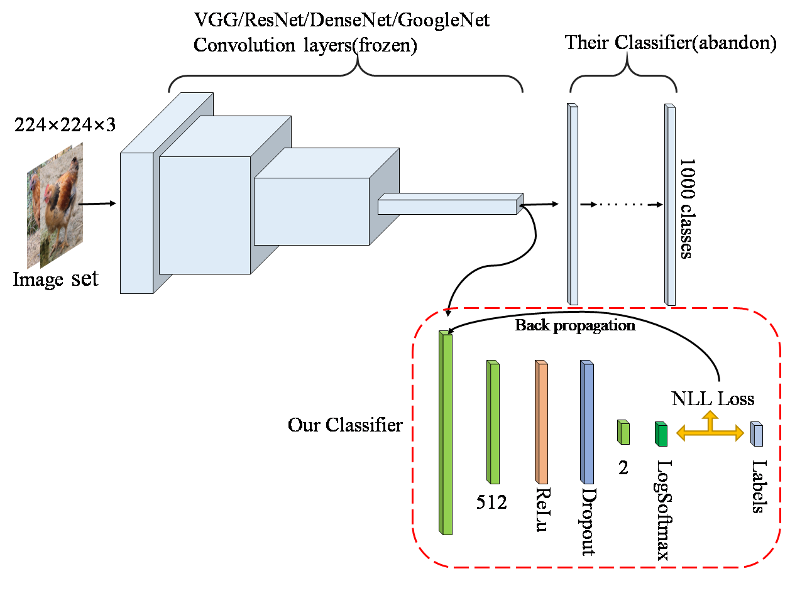
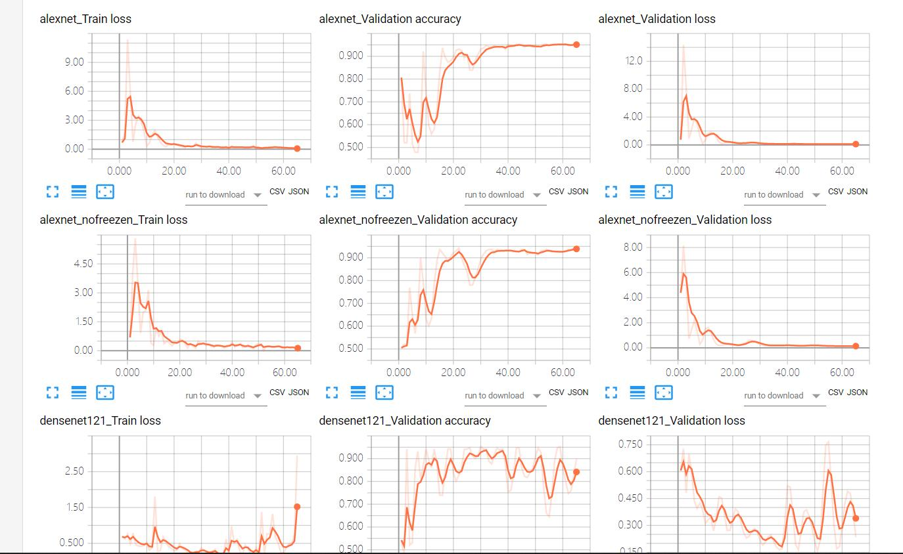
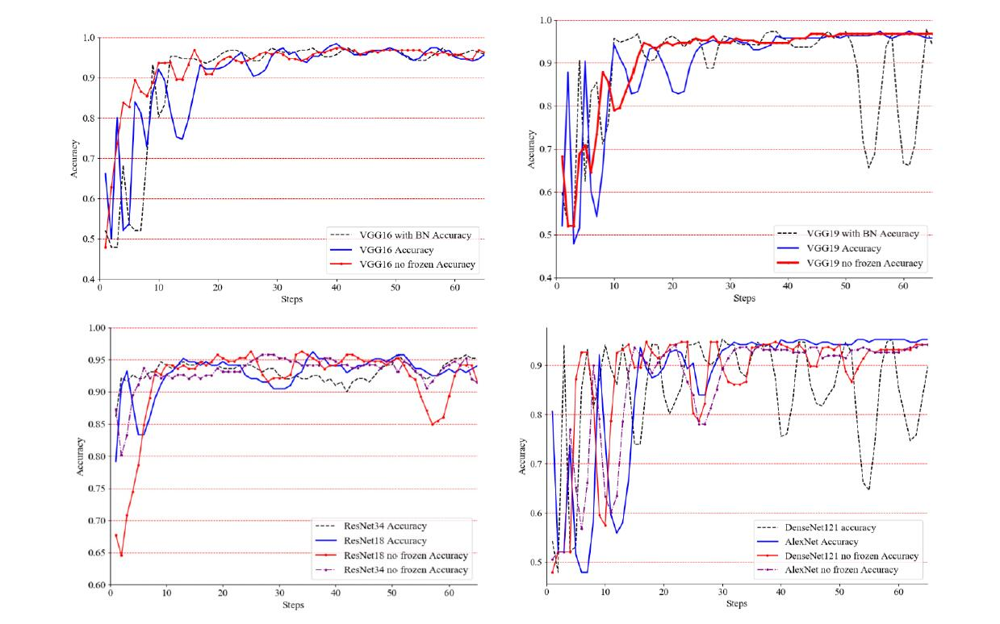

# A classifier with PyTorch

**本代码调用Torchvision里的models，分类网络主题框架均是出自torchvision**
```python
from .alexnet import *
from .resnet import *
from .vgg import *
from .squeezenet import *
from .inception import *
from .densenet import *
from .googlenet import *
from .mobilenet import *
from .mnasnet import *
from .shufflenetv2 import *
from . import segmentation
from . import detection
from . import video
```
```python
#Several classification frameworks are available
AlexNet、densenet121、densenet169、densenet201、densenet161、GoogLeNet、Inception3、mnasnet0_5、mnasnet0_75、mnasnet1_0、mnasnet1_3、MobileNetV2、resnet18、resnet34、resnet50、resnet101、resnet152、resnext50_32x4d、resnext101_32x8d、wide_resnet50_2、wide_resnet101_2、vgg11、vgg13、vgg16、vgg19、vgg11_bn、vgg13_bn、vgg16_bn、vgg19_bn...........
```
 
上述为models里可用的经典网络框架，且只针对里面的分类网络。本代码是可以采取迁移学习，下载在ImageNet预训练好的初始模型然后在你的代码上进行迁移学习,并且可冻结卷积层只训练全连接层，或者全局训练，我们只使用了上述经典网络的的卷积层，然后将卷积结果套在了我们的轻量级分类器上，


## Train on our datasets
我们使用了这个分类器在鸡的性别上做了预测分类，我们使用了vgg16,vgg16_bn,vgg19,vgg19_bn,resnet18,resnet34、densenet101进行了比较。你可以在此处获取我们的[数据集](https://drive.google.com/open?id=1eGq8dWGL0I3rW2B9eJ_casH0_D3x7R73 "数据集")(谷歌云盘，所以大陆用户需翻墙访问，如不能翻墙，如有需要可发邮件给我)
**Some sample images from Our dataset**
 

## Train on Custom Dataset
```
-your datasets
 |--train
 |   |--label_1
 |   |--label_2
 |   |--label_n
 |--test or Val
	 |--label_1
	 |--label_2
	 |--label_n
```
你的数据集需要如同上述文件结构的形式。且需要将代码中的输出的二分类改成你的n分类，也就是将最后输出的2换成n。
`python train.py --data_directory=your dataset --arch=vgg16`
## Visualization of Training Process
**采用tensorboard进行可视化操作，训练完成后你可以输入以下命令进行可视化**
`tensorboard --logdirs=logs`



**然后你便可以访问如下网页并下载相应CSV，然后根据csv_plot.py进行训练过程的绘图操作：**

